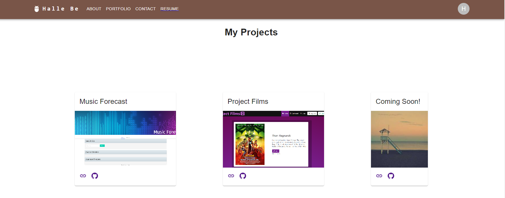
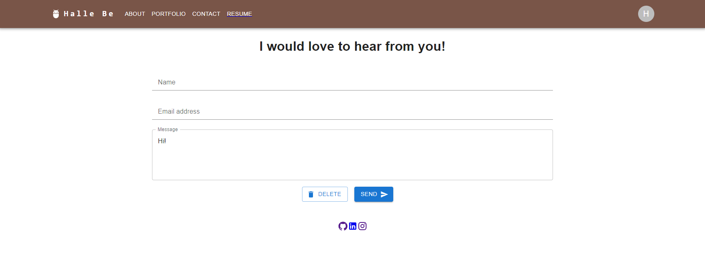

# React-Portfolio

## Description

This portfolio was created with React.js. Portfolios are made for future employers to view potential candidates' skills and projects.

## Usage

* Navigate app by clicking through menu items.
* Menu items will take to designated page.
* Footer has icons that will take users to desired page.
  

## Screenshots

## Credits

Halle Be

## Questions

[github](https://github.com/slurpsz)
email: khtbee@gmail.com